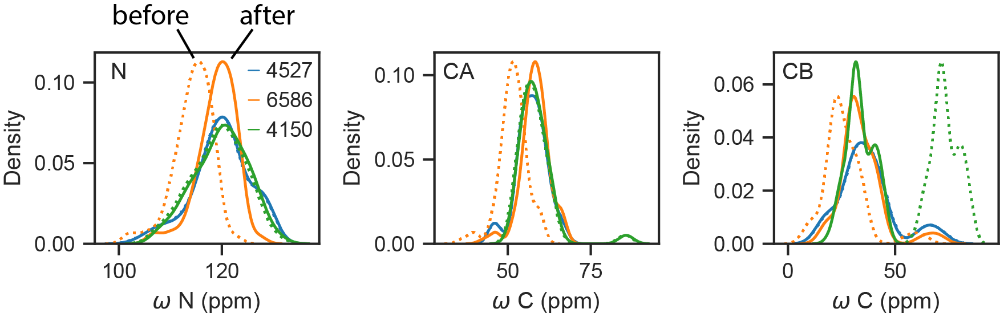

# `makeshift`: lightweight NMR tools

A dependency-light open-source Python package for working with biomolecular NMR data from either custom input or
[NMR-STAR](https://pynmrstar.readthedocs.io/en/latest/) files from the [BMRB](https://bmrb.io/).

## Installation

```bash
pip install git+https://github.com/WaymentSteeleLab/makeshift.git
```

## Quickstart

```python
import makeshift as ms

# Fetch and parse a BMRB entry into tidy chemical shifts
cs = ms.ChemicalShifts.from_bmrb(5363)
cs.data            # one row per shift: Seq_ID, Comp_ID, Atom_ID, Atom_type, Val
cs.sequences()     # one row per entity: ID, polymer type, sequence

# Re-reference shifts
cs = ms.ChemicalShifts.from_bmrb(4527, reref="lacs", calc_csi=True)
cs.reref_offsets   # {atom: offset applied}

# Build an assigned peak list (e.g. for an HSQC)
peaks = cs.peaklist()
peaks.data
```

## Modules

| Module | What it does |
|---|---|
| `makeshift` (core) | `ChemicalShifts`, `NMRStarEntry`, `PeakList` — fetch/parse BMRB entries, extract shifts, sequences, relaxation/order-parameter data, build peak lists. |
| `makeshift.reref` | LACS and PANAV chemical-shift re-referencing (via `ChemicalShifts.reref`). |
| `makeshift.spectra` | Read Sparky `.ucsf` spectra (`Spectrum`), pick peaks, and align peak lists (`map_peaklists`). |
| `makeshift.relaxation` | CPMG dispersion pipeline (`CPMGExperiment`) and `RelaxationProfile` — RelaxDB-style per-residue dynamics from deposited R1/R2/NOE. |
| `makeshift.hydronmr` | Predict per-residue T1/T2/NOE from a PDB structure (`run`). |
| `makeshift.talosn` | Predict backbone torsion angles, S2 order parameters, and secondary structure from chemical shifts via the NIH TALOS-N binary (`TalosN`). |
| `makeshift.utils` | Dependency-light helpers: dataset/structure fetching (`fetch_structure`), constants. |

See `demos/` for worked examples: 
- `quick_start.ipynb` (core workflow),
- `reref.ipynb` (re-referencing), 
- `cpmg_demo.ipynb` (the CPMG pipeline),
- `bmrb_relaxation_demo.ipynb` (deposited relaxation → dynamics profile)
- `talosn_demo.ipynb` (TALOS-N prediction).

## Re-referencing

BMRB shifts are sometimes mis-referenced — a constant offset shifts every peak
of a given nucleus. `ChemicalShifts.reref` corrects this in place using one of
two methods:

- **PANAV** ([Wang & Wishart 2005](https://pubmed.ncbi.nlm.nih.gov/15772753/)) —
  uses rarely-misreferenced HA shifts to assign secondary structure, then aligns
  N/CA/CB to curated per-structure reference distributions
  ([Wang & Jardetzky 2002](https://onlinelibrary.wiley.com/doi/10.1110/ps.3180102)).
- **LACS** ([Wang & Markley 2009](https://pmc.ncbi.nlm.nih.gov/articles/PMC2782637/)) —
  fits secondary shift vs. CSI so the random-coil regime intercepts at the origin;
  covers CA, CB, C′, N, and HN.

```python
cs = ms.ChemicalShifts.from_bmrb(4527)
cs.reref(method="panav")   # or "lacs"
print(cs.reref_offsets)    # {'N': ..., 'CA': ..., 'CB': ..., ...}
```



Entry 4527 is correctly referenced; entries 6586 and 4150 have been described in
the literature as needing re-referencing. The two methods have not yet been
extensively compared.

## Relaxation and dynamics

`NMRStarEntry` extracts any deposited relaxation data, and `RelaxationProfile`
turns it into a per-residue dynamics analysis in the style of RelaxDB
([Wayment-Steele, El Nesr et al.](https://www.biorxiv.org/content/10.1101/2025.03.19.642801)).

Pull deposited data straight from an entry:

```python
entry = ms.NMRStarEntry.from_bmrb(25013)
entry.datasets()                 # which data types the entry holds
entry.relaxation("T2")           # R2 (also "T1"/"R1", "T1rho", "NOE") — units-aware
entry.order_parameters()         # model-free S2 (S2, Tau_e, Rex)
entry.data_loop("spectral_density_values", "_Spectral_density")  # anything else
```

`RelaxationProfile` assembles R1/R2/NOE into the R₂/R₁ observable, compares it to
a HYDRONMR rigid-body prediction, and labels each residue by motional regime:

```python
from makeshift.relaxation import RelaxationProfile

prof = RelaxationProfile.from_bmrb(25013)   # pulls T1/T2/NOE, aligns to the sequence
prof.add_rigid_prediction()                 # structure: deposited PDB → RCSB, else AlphaFold → AFDB
print(prof.label())                         # per-residue motion string
prof.plot("R2_R1")
```

The structure for the rigid prediction can be a local PDB, a PDB id (fetched
from RCSB), or a UniProt accession (fetched from AlphaFold DB) — e.g.
`add_rigid_prediction("1WRP")`, `("P0DP23")`, or `("model.pdb")`; with no
argument it uses the entry's own cited PDB or AlphaFold model. makeshift does not
predict structure itself.

Label tokens: `A` ordered, `^` µs–ms exchange (elevated R₂/R₁), `v` ps–ns motion
(hetNOE ≤ 0.65), `b` both, `.` peak missing, `t` disordered terminus, `p` proline.

## TALOS-N: prediction from chemical shifts

`makeshift.talosn` wraps the NIH
[TALOS-N](https://spin.niddk.nih.gov/bax-apps/software/TALOS-N/) binary (Shen &
Bax, *J. Biomol. NMR* 2013), which predicts backbone φ/ψ torsion angles,
per-residue S2 order parameters, and secondary structure from assigned backbone
chemical shifts using a trained neural network.

The binary and its database aren't bundled — they're downloaded on demand from
NIH (under their [Terms of Use](https://spin.niddk.nih.gov/bax-apps/terms.html),
which the installer prints) into a `data_dir` you choose. Keep that path in a
variable and pass the same one to install and to each `TalosN`:

```python
from pathlib import Path
from makeshift import talosn

data_dir = Path.home() / "talosn_data"
talosn.install_talosn_data(data_dir=data_dir)     # one-time, ~ a few hundred MB

tn = talosn.TalosN.from_bmrb(4527, data_dir=data_dir)
tn.run()                    # or run(auto_install=True) to fetch the binary on first use
tn.order_parameters         # predS2.tab — per-residue S2
tn.torsion_angles           # pred.tab   — φ/ψ per residue + confidence class
tn.secondary_structure      # predSS.tab — helix/sheet/coil
```

`data_dir` defaults to inside the installed package if omitted (usually not what
you want for a few-hundred-MB download).

## NMR-STAR concepts

NMR-STAR files are organised around **saveframes**, each belonging to a category
(e.g. `assigned_chemical_shifts`, `entity`, `sample`). The three you interact
with most:

- **Entry** — a single BMRB deposition (one `.str` file).
- **Entity** — a distinct molecular species (protein, DNA strand, ligand), each
  with its own `Entity_ID`.
- **Chemical shift list** — the `_Atom_chem_shift` loop inside an
  `assigned_chemical_shifts` saveframe; one row per observed shift.

## License

MIT License.

`makeshift.talosn` downloads and runs the TALOS-N binary, which is distributed
separately by NIH under its own
[Terms of Use](https://spin.niddk.nih.gov/bax-apps/terms.html) (including no
redistribution without permission from the authors); those terms govern the
downloaded software, not this wrapper.

## Acknowledgments

- The [Biological Magnetic Resonance Bank (BMRB)](https://bmrb.io/) for maintaining and sharing NMR data.
- The Bax lab at NIH for [TALOS-N](https://spin.niddk.nih.gov/bax-apps/software/TALOS-N/).