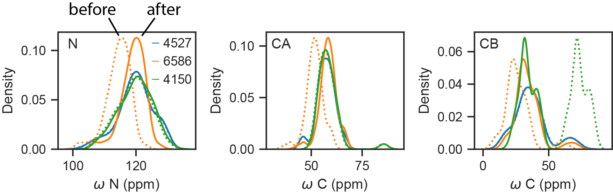

# Re-referencing

BMRB shifts are sometimes mis-referenced — a constant offset shifts every peak of
a given nucleus. [`ChemicalShifts.reref`](../api/chemshift.md) corrects this in
place using one of two published methods.

## Usage

```python
import makeshift as ms

cs = ms.ChemicalShifts.from_bmrb(4527)
cs.reref(method="panav")     # or "lacs"
print(cs.reref_offsets)      # {'N': ..., 'CA': ..., 'CB': ..., ...}
print(cs.reref_cona)         # CONA fragment-scan summary (PANAV only)
```

Or apply it on load:

```python
cs = ms.ChemicalShifts.from_bmrb(4527, reref="lacs")
```

`reref_offsets` holds the offset applied to each nucleus
(`corrected = Val + offset`, paper convention `offset ≈ d_ave − d_obs`),
so the correction is fully transparent and reversible.

## The two methods

### PANAV

**PANAV** ([Wang & Wishart 2005](https://pubmed.ncbi.nlm.nih.gov/15772753/);
[Wang, Wang & Wishart 2010](https://pubmed.ncbi.nlm.nih.gov/20446018/))
assigns secondary structure from HA (PSSI joint probabilities + a short
density smooth), fits N/CA/CB/C′ offsets as
`<Δδ> = mean(d_ave − d_obs)`, then refreshes SS twice with trial-adjusted
C/N. Deviant atoms (6σ) are excluded. Afterward **CONA** scores contiguous
3–6 residue windows (`cs.reref_cona`).

```python
cs.reref(method="panav")
```

### LACS
**LACS** ([Wang et al. 2005](https://pubmed.ncbi.nlm.nih.gov/16041479/);
[Wang & Markley 2009](https://pmc.ncbi.nlm.nih.gov/articles/PMC2782637/))
fits secondary shift vs. CSI (CA−CB) so the random-coil regime intercepts at
the origin; it covers CA, CB, C′, N, and HN. Coil baselines include
nearest-neighbor corrections from official LACS (BMRB / Liya Wang): Wishart
Table 5 pre-Pro for CA/CB/C′, and Wishart Table 8 i−1 correction for N. The N/H
fit excludes GLY/CYS/PRO on **residue i−1** .

```python
cs.reref(method="lacs")
```

For example, entries 6586 and 4150 have been described in the literature as needing re-referencing.



## Under the hood

The [`makeshift.reref`](../api/reref.md) subpackage exposes the underlying
routines if you want to work with raw DataFrames rather than a `ChemicalShifts`
object, you can use `compute_offsets`, `apply_offsets`, `reref_lacs`, and `reref_panav`.

## Full API

See the [re-referencing reference](../api/reref.md).
