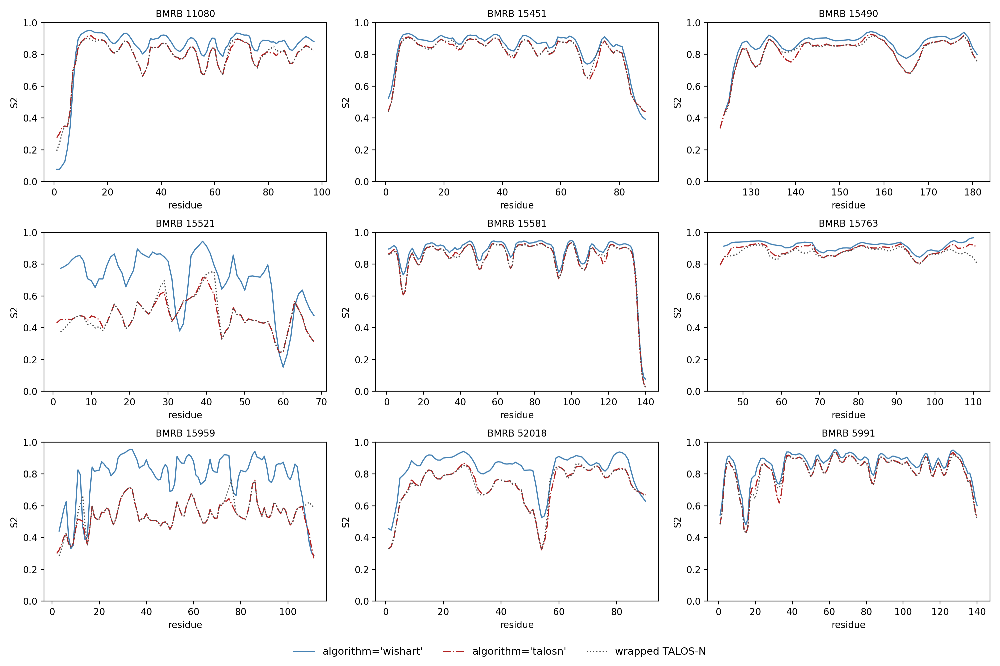

# RCI validation report

`makeshift.rci.RCI` predicts per-residue backbone flexibility (Random Coil
Index) from assigned chemical shifts, with two interchangeable algorithm
backends:

- **`algorithm="wishart"`** (default) — a direct port of the reference
  implementation, `rci_v_1c.py` (Berjanskii & Wishart, *J. Biomol. NMR*
  2005), reproducing its chemical-shift-deviation smoothing, gap-filling,
  and terminal-correction logic.
- **`algorithm="talosn"`** — an independent port of the RCI-S² module
  bundled inside TALOS-N (Shen & Bax), reverse-engineered from the
  TALOS-N v4.11/v4.21 C++ source (`RCI.cpp`/`TALOS.cpp`). This is a
  related but algorithmically distinct predictor from `rci_v_1c.py` —
  simpler neighbor averaging, no gap-filling, and TALOS-N's own
  conventions for missing chemical shifts.

This report documents how each was validated, the bugs the validation
process surfaced (in both `makeshift.rci` and `makeshift.talosn`), and
what's still known to be imperfect.

## `algorithm="wishart"`: validated to machine precision

`rci_v_1c.py` ships its own bundled test case (BMRB 4403 / `PyJCScorr`,
the J domain of murine polyomavirus T antigen) with expected RCI output.
`tests/test_rci_regression.py::test_rci_matches_reference_output` runs
makeshift's port against that fixture and asserts agreement to `1e-6`.
Actual agreement is closer to `1e-14` (floating-point noise) — this
backend is a line-for-line translation of the reference script's default
code path, not a reimplementation from a specification.

## `algorithm="talosn"`: validated against the compiled binary

There's no equivalent bundled test case for TALOS-N's RCI-S² module, so
this backend was validated by comparing its output against the real,
compiled TALOS-N v4.11/v4.21 binary (via `makeshift.talosn.TalosN`)
across 9 BMRB entries chosen for size and chemical-shift-completeness
diversity: **11080, 15451, 15490, 15521, 15581, 15763, 15959, 52018,
5991** (856 residues total). A debug-instrumented rebuild of the actual
v4.11 source (built under Docker to run the Linux binary on macOS)
additionally confirmed exact intermediate values on a spot check,
including the S² output-inversion formula (`1.003 - 0.4*ln(1+17.7*RCI)`)
used when TALOS.cpp writes its `predS2.tab`.

### Bugs found during validation

Three real bugs were found and fixed in the course of this comparison —
two of which also affected `makeshift.talosn` (the TALOS-N wrapper)
independently of anything RCI-specific, meaning they corrupted the
*actual TALOS-N binary's own output*, not just the Python port being
validated against it.

**1. Wrong starting residue number (`makeshift.rci` and `makeshift.talosn`).**
Both modules inferred a chain's first residue number as
`min(observed Seq_ID)` — the lowest `Seq_ID` with an assigned chemical
shift — rather than the entity's own authoritative numbering. Those
are usually the same, but diverge whenever N-terminal residues have no
assigned shifts (disordered regions, cleaved tags, etc.), silently
misaligning every downstream random-coil-reference lookup for the
entire chain. BMRB 15490 is a striking example: the full sequence is
181 residues, but the first assigned shift isn't until residue 124 (1–123
unassigned) — the old code assumed the sequence *string* itself started
at residue 124, reading amino acid identities ~123 positions further
into the sequence than it should have at every single lookup. This also
crashed the real TALOS-N binary outright for this entry ("Format
Errors: Too Many Sequence Mismatches: 311, 5 Max") before the fix.

  Fixed via `NMRStarEntry.residue_numbering()`/`resolve_first_resid()`
  (`makeshift/entry.py`), which reads the entity's true per-residue
  numbering from `_Entity_comp_index` and is now used by both
  `RCI.from_entry()`/`.calc()` and `TalosN.from_entry()`.

**2. Gly's HA2/HA3 dropped before reaching TALOS-N (`makeshift.talosn`).**
`filter_backbone()`'s atom whitelist (`_BACKBONE` +
`("HN",)`) only included literal `"HA"` — but Gly's two prochiral
H-alpha protons are essentially always deposited as `"HA2"`/`"HA3"`
under standard BMRB naming, never plain `"HA"`. Every Gly residue's HA
data was silently excluded from the file written for the TALOS-N
binary, so TALOS-N always saw Gly's HA as missing. TALOS-N's own C++
code expects the raw `HA2`/`HA3` entries (it averages them internally),
not a pre-averaged `HA` value — so the fix was adding `"HA2"`/`"HA3"` to
`BACKBONE_ATOMS` in `makeshift/talosn/utils.py`, not averaging in
Python.

**3. Atoms never observed at all were treated as contributing nothing (`makeshift.rci`, `algorithm="talosn"` only).**
TALOS-N's `inCS_convert_TALOS2RCI` doesn't simply zero out an
atom that was never deposited — it synthesizes a deviation from
TALOS-N's own random-coil-adjustment tables (`randcoil.tab`/
`rcadj.tab`/`rcprev.tab`/`rcnext.tab`, ported to
`makeshift/data/rci_data/talosn_*.csv`) minus RCI's own Schwarzinger
reference. That synthetic residual is real and usually nonzero, and
isn't filtered out by the downstream window-averaging (which only skips
*exact* zeros). This matters most for inputs missing most of
HA/C/CA/CB (e.g. N/H-only depositions), where — before the fix — the
missing-atom contribution was incorrectly treated as pure zero instead
of this synthesized value. See `makeshift/rci/_talosn.py`.

### Validated accuracy (current)

Pooled across all 9 entries, comparing `RCI(algorithm="talosn")`
against the real TALOS-N binary's own `predS2.tab`:

| Metric | Value |
|---|---|
| Pearson r | 0.989 |
| Median absolute S² deviation | 0.0010 |
| Residues within 0.01 | 82.1% |
| Residues within 0.05 | 96.0% |
| n | 856 residues |

Per-entry breakdown:

| BMRB | n | r | median abs diff | max abs diff |
|---|---|---|---|---|
| 11080 | 97 | 0.9955 | 0.0009 | 0.0829 |
| 15451 | 89 | 0.9952 | 0.0009 | 0.0679 |
| 15490 | 58 | 0.9877 | 0.0018 | 0.0689 |
| 15521 | 67 | 0.9640 | 0.0004 | 0.1412 |
| 15581 | 140 | 0.9979 | 0.0008 | 0.0598 |
| 15763 | 67 | 0.7654 | 0.0084 | 0.1040 |
| 15959 | 108 | 0.8278 | 0.0004 | 0.3209 |
| 52018 | 90 | 0.9919 | 0.0009 | 0.1050 |
| 5991 | 140 | 0.9877 | 0.0010 | 0.0949 |

This climbed from r=0.968 (median diff 0.0145) once bug #3 above was
fixed, to r=0.989 (median diff 0.0010) after bugs #1 and #2 were also
found and fixed; see git history for `makeshift/entry.py`,
`makeshift/rci/_talosn.py`, and `makeshift/talosn/utils.py`.

### Known remaining gap: `calcAverageCS`

The residual error is concentrated at Pro/Gly and residues near a
genuinely missing chemical shift (mean absolute S² diff by residue
type: Pro 0.034, Gly ~0.011–0.018 depending on the comparison run,
vs. 0.005–0.016 for everything else). This traces to
`TALOS.cpp::calcAverageCS`: when a residue is missing an atom but its
immediate neighbors are otherwise complete, TALOS-N doesn't fall back to
a simple table residual — it searches TALOS-N's own bundled reference
protein database for the best homology- and shift-similarity-weighted
match, and predicts a value from that. `makeshift`'s port instead always
uses the simpler `talosn_rc - simpred` table residual (bug #3 above).

Porting `calcAverageCS` faithfully would mean porting TALOS-N's bundled
reference database and its nearest-neighbor search/scoring algorithm —
a substantially larger undertaking than anything else in this report,
not a quick fix. Gly is disproportionately affected because it *always*
has a "missing" CB (it has no CB atom at all), so this search path is
triggered for essentially every Gly residue, whereas for other residue
types it only fires when a shift happens to be genuinely unassigned.
This has been left unported; the resulting gap is well-characterized and
documented in `makeshift/rci/_talosn.py`.

## Reproducing this validation

- `tests/test_rci_regression.py` — pins both algorithm backends against
  fixed expected output (`PyJCScorr` / BMRB 4403); runs in CI, no network
  or binary required.
- `demos/rci_algorithm_validation.py` — regenerates the 9-entry, 3-trace
  comparison figure (`algorithm='wishart'`, `algorithm='talosn'`, and the
  real wrapped TALOS-N binary) shown below. Requires network access
  (fetches BMRB entries live) and the TALOS-N binary (auto-installed on
  first run); not run in CI.

